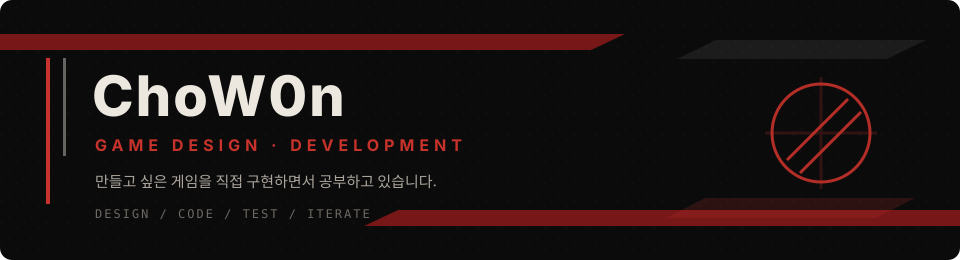
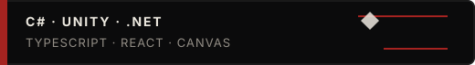
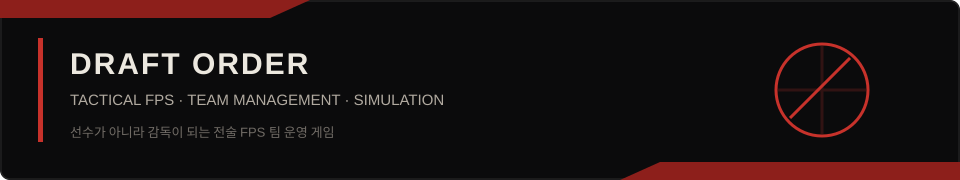
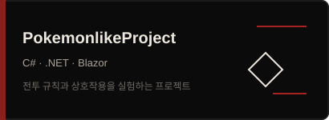
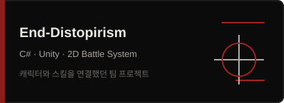

  

게임 기획자를 목표로,  
만들고 싶은 게임을 직접 구현하면서 공부하고 있습니다.

  

TypeScript · React · Canvas &nbsp; / &nbsp; <a href="https://github.com/ChoW0n/fps-Pro-Team-Manager/blob/main/docs/PROJECT_STATE.md">작업 현황 ↗</a>

 

  

게임 화면 / 작업 기록

 

**DRAFT ORDER**

팀을 짜고, 오퍼레이터와 작전을 고른 뒤 5대5 경기를 지켜봅니다.  
전술의 차이가 선수 움직임에서 보이게 만드는 중입니다.

<!-- 저장소에 남아 있는 개발 캡처입니다. 현재 버전의 실시간 화면은 아닙니다. -->

저장소에 남겨둔 개발 화면 · 최신 상태는 <a href="https://github.com/ChoW0n/fps-Pro-Team-Manager/blob/main/docs/PROJECT_STATE.md">작업 현황</a>에서 볼 수 있습니다.

 

**PokemonlikeProject**

기술과 특성, 날씨가 겹쳤을 때의 처리를 다루고 있습니다.

<a href="https://github.com/ChoW0n/PokemonlikeProject/tree/main/PokemonBattle.Tests">전투 규칙 테스트</a>

 

**End-Distopirism**

전투 진행과 대상 선택, UI와 연출을 연결하며 작업했던 기록입니다.

 

<a href="https://github.com/ChoW0n?tab=repositories">다른 공부 기록 보기 ↗</a>
